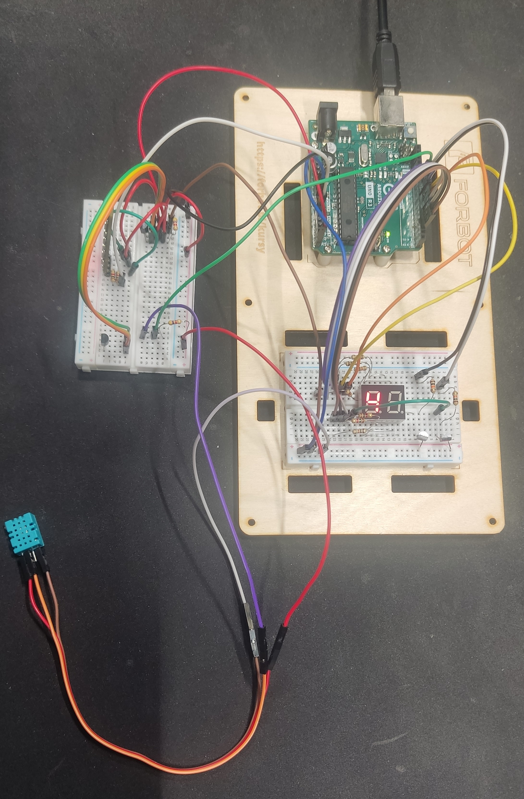

# Weather Station with Arduino UNO

This project is a compact weather station built with an Arduino UNO R3. It measures temperature and humidity using DHT11 and two DS18B20 sensors, and visually displays data on a 7-segment display and an RGB LED bar (WS2812). It’s perfect for indoor climate monitoring and learning about sensor integration.

## 🧰 Components Used

| Component                  | Quantity | Description                            |
| -------------------------- | -------- | -------------------------------------- |
| Arduino UNO R3             | 1        | Main microcontroller board             |
| DHT11 Sensor               | 1        | Humidity and temperature sensor        |
| DS18B20 Temperature Sensor | 2        | Waterproof digital temperature sensors |
| WS2812 LED Bar             | 1        | RGB LED strip with 8 addressable LEDs  |
| 7-Segment Display          | 1        | LDD040AUE-101A 2-digit common cathode  |
| BC547 NPN Transistor       | 2        | Used for segment switching             |
| Resistor 10kΩ              | 1        | Pull-up for DHT11 or DS18B20           |
| Resistor 4.7kΩ             | 1        | Pull-up for DS18B20 data line          |
| Resistor 1kΩ               | several  | Current limiting for segment display   |
| Breadboard & Jump Wires    | -        | For wiring                             |

## 🧠 Features

- 🌡️ **Temperature Reading**
  - DS18B20: Two sensors, accurate and waterproof.
  - DHT11: For quick temperature and humidity measurement.
- 💧 **Humidity Display**
  - Measured using the DHT11 and displayed in real-time.
- 🔢 **Digital Display**
  - 2-digit 7-segment display (LDD040AUE-101A) for humidity.
- 🌈 **RGB LED Thermometer**
  - Displays temperature using a gradient of red (hot) and blue (cold) LEDs.
- 🔌 **Brightness Control**
  - NeoPixel brightness is reduced for power saving and comfort.

## ⚙️ How It Works

- The **DHT11** sensor reads **humidity** and basic **temperature** data.
- The **DS18B20** sensors provide accurate **temperature** readings for comparison or multi-point monitoring.
- The **7-segment display** shows the current **humidity** value.
- The **WS2812 LED bar** acts as a **color thermometer**:
  - Temperatures above 0°C are displayed in red.
  - Temperatures below 0°C are displayed in blue.
- The system uses `SevSeg`, `DallasTemperature`, `OneWire`, and `Adafruit_NeoPixel` libraries for sensor and display control.

## 🧪 Library Dependencies

Make sure to install these libraries in the Arduino IDE:

- `SevSeg`
- `DallasTemperature`
- `OneWire`
- `Adafruit_NeoPixel`
- `DHT` by Rob Tillaart (if not using the Adafruit one)

## 🔌 Wiring Overview

- **DHT11** → Data pin to D11 with 10kΩ pull-up resistor.
- **DS18B20** → Connected to A5 with 4.7kΩ pull-up resistor.
- **7-Segment Display** → Connected through transistors to digital pins.
- **WS2812 LED Bar** → Data pin to A0 with optional 330Ω resistor.
- **Common Ground** for all components and external power for LED bar (if needed).

## 📷 Preview

